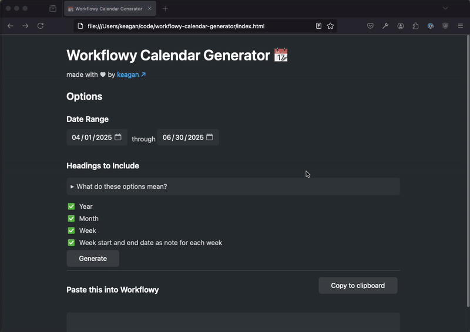

# Workflowy Calendar Generator 📆

Generate a calendar structure with Workflowy dates. Options include a node for the year, the month, and the option to select what range of dates you want to generate. [Click here to try it out!](https://www.workflowy-calendar-generator.com/)

If you aren't looking for Workflowy dates, you can just as easily get a plain text calendar with Python scripts from [Olafbond](https://github.com/olafbond/WorkFlowy-calendar-script/tree/main) or [guidoknoop](https://github.com/guidoknoop/workflowy-calendar-generator).
